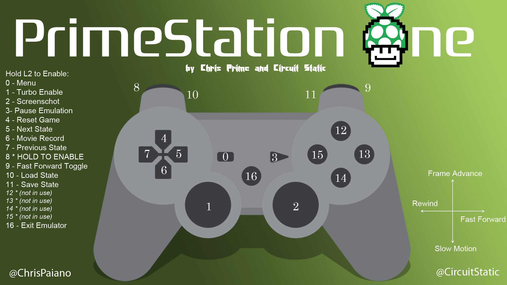

# PrimeStation One
## A Set of Scripts and Tools For a "Ready-To-Go" RetroPie (for Raspberry Pi, model B+ recommended) with PS3 controls ready and configured to work with Bluetooth or USB on multiple games and game system emulations.

#### Please Note: The PrimeStation One's main driving force is to do ALL THE THINGS!
=============

### PS3 Controller Layout / Quick Reference: 

https://github.com/free5ty1e/primestationone/blob/master/splashscreen.png 

## BASIC USAGE
You can download an actual ready-to-go PrimeStationOne image from our VerilyShare at (http://goo.gl/5rzgcj).  Download count from this link since 20141224 @ 7pm PST can be found at the following analytics link: (http://goo.gl/#analytics/goo.gl/5rzgcj/all_time) 

The first alpha release should be available in time for Christmas 2014! 

If you have managed to obtain one of these releases, extract the .7z archive so you have the .img file.  

Here are the commands to write the image file on Mac and Linux with a progress bar as well.  The v0.91 alpha release archive is used for this example, adjust accordingly if you have a different version.  We apologize, but as of this time the PrimeStation One is being developed on a 16GB SD card and so that is going to be the minimum size SD card you will need to utilize this image sensibly:

Install on Mac: (`brew install pv` if you don't have pv.  If you don't have Homebrew, too bad for you.)   Replace the device `/dev/disk1` with your SD card.
```
        pv --size 16000000000 primeStationOne16gV0.91alpha.img | sudo dd bs=2m of=/dev/disk1
```

Install on Linux:  Replace the device `/dev/sdb` with your SD card.
```
        sudo dd bs=2M if=primeStationOne16gV0.6a.img of=/dev/sdb
```


#### CONTINUE IF YOU WANT TO START FROM A FRESH RETROPIE IMAGE INSTEAD (can use 8GB SD card):
Install RetroPie (https://github.com/petrockblog/RetroPie-Setup) by writing the SD card image v2.3 downloaded from their site (http://blog.petrockblock.com/retropie/retropie-downloads/).  

Once you can type 'emulationstation' from the command line and get into the basic EmulationStation interface and see one or two entries, you can continue with the PrimeStation One overlay scripts.

Clone the github repo for the primeStationOne to your Pi home folder and start the setup. (git pull is included in case you want to copy / paste the entire block below and paste into an SSH terminal window, to update if you've already cloned)
```
        cd ~
        git clone https://github.com/free5ty1e/primestationone.git
        cd primestationone
        git pull
        bin/primeStationOneSetup
```
    
Once this script completes, you should end up in the `RetroPie-Setup/retropie_setup.sh` menu, and you can just exit at this point if you'd like and restart (as your Pi may or may not have updated its firmware in the process as part of the self updating stuffs).  Note:  You can now type `restart` to restart the thing or `off` to turn off the thing.
    
At this point, there is a menu entry in the EmulationStation Settings menu page (script page) to `updatePrimeStationOneFull.sh`, which you can also type in a command terminal.  It will perform a git pull to retrieve the latest verison of the setup script and supporting files, and run the `bin/primeStationOneSetup` again to ensure the latest things are thinged for your maximum thingness.
    
There is also a quick update, which takes care of only git repo updates for primestationone and RetroPie-Setup, installs primestationone files to correct locations, installs primestationone cronjobs and configures mplayer.  This all happens far faster than the full setup command.  Also: it happens every reboot via a cronjob.  Neat!  Type `quickUpdatePrimestationOneFiles` to execute the quick update (it is also in the Settings page in Emulationstation for convenience)
    
The `~/splashscreen.png` file can also be shown by typing `splashscreenQuickReference.sh`, or selecting this script from the Settings page in Emulationstation.  This also shows the layout of the PS3 controller for the auxiliary and management functions of RetroArch for most emulators (those with libretocores, of course).
    
So far mainly tested with the RetroPie image v2.3 downloaded from their site and written to SD card using a dd command.  Not sure if the very latest RetroPie built from sources will work correctly with these files, but we plan to test it soon!


## FUTURE
* Add the `opt/vc/src/hello_pi/*` demos to the Settings / Tools menu, or even a new Demos menu as these are neat to show off and why not?
* Quick reference image / controller layout / emulator notes for special emulators such as FastDosBox and RPix86 and the C64 emulator that shows via launchs script for X seconds before / while the actual emulator is loading up, so the user knows what might be useful to try on a controller from a couch...
* Menu system to handle running services, both for the current session and for all future sessions (services enabled / disabled upon startup).  The PrimeStation One can do a lot, and sometimes its nice to turn some unused features off!
* Resolve issue with using higher resolutions while still maintaining the ability to exit FastDosBox and Vice and similar emulators without requiring a hard reboot (for now, everything is running in 640x480 mode to alleviate this issue)
* Resolve issue where sometimes exiting EmulationStation will leave the user with a blank black screen; currently have to press ALT + Right Arrow then ALT + Left Arrow to change terminals away and back and reinitialize the display sometimes.
* Add START + SELECT to request a soft reboot of the Pi for panic / crash situations.  This might just end up pressing CTRL-ALT-DEL if we continue to find this actually does work like we think it does...

Comments / suggestions / contributions to the code welcome!  

Credits: 
* Chris "Prime" Paiano (Founder, Lead Developer) - Twitter: @ChrisPaiano
* "Circuit Static" (User Experience, Quality, Development & Marketing) - Twitter: @CircuitStatic

Standing on the Shoulders of Giants:
* RetroPie project (https://github.com/petrockblog/RetroPie-Setup)
* XRDP project (https://github.com/kx499/xrdp)
* QtSixA project (http://qtsixa.sourceforge.net/)
